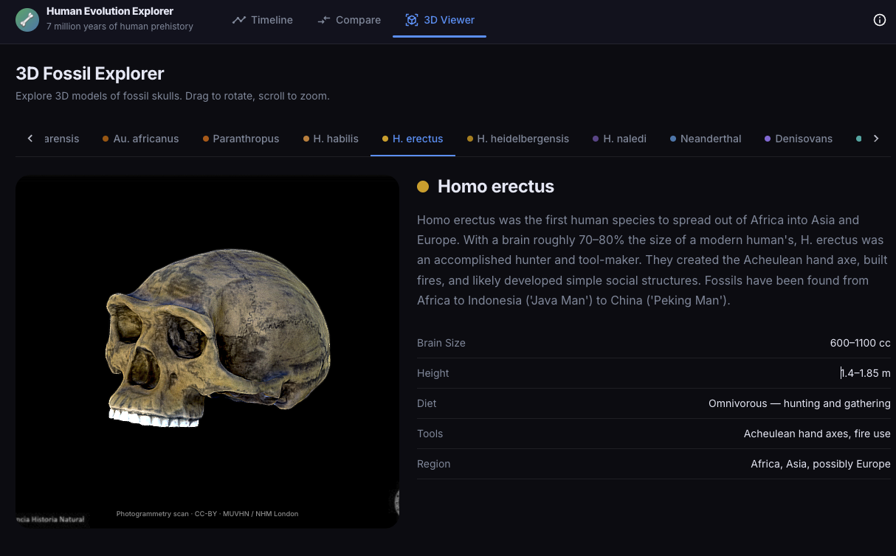

# Human Evolution Explorer
 
[Demo at Vercel](https://asteroids-eight-opal.vercel.app/)
An interactive web app for exploring 13 hominin species across 7 million years of human evolution. Browse an interactive timeline, view real photogrammetry skull scans, compare species side-by-side, and read detailed profiles for each species.

## Features

- **Interactive Timeline** — Visualize all 13 species plotted across geological time from Sahelanthropus (~7 Mya) to Homo sapiens
- **3D Skull Viewer** — Embedded Sketchfab photogrammetry scans for 13/13 species (real fossil casts and reconstructions). Denisovans uses the Harbin cranium reconstruction. Procedural Three.js skull remains available as a fallback mode
- **Species Detail Panel** — Traits, range, ancestors/descendants, and a description for each species
- **Side-by-side Comparison** — Select any two species to compare their skulls and key traits
- **Search & Filter** — Search species by name across the timeline and home view

## Species Covered

| Species | Age | Skull Model Source |
|---|---|---|
| Sahelanthropus tchadensis | ~7–6 Mya | MUVHN (CC-BY-NC) |
| Ardipithecus ramidus | ~4.4–4.2 Mya | MUVHN (CC-BY) |
| Australopithecus afarensis | ~3.9–2.9 Mya | MUVHN (CC-BY) |
| Australopithecus africanus | ~3.3–2.1 Mya | MUVHN (CC-BY) |
| Paranthropus boisei | ~2.7–1.2 Mya | MUVHN (CC-BY) |
| Homo habilis | ~2.4–1.4 Mya | MUVHN (CC-BY) |
| Homo erectus | ~1.9–0.1 Mya | MUVHN (CC-BY) |
| Homo heidelbergensis | ~700–200 Kya | MUVHN (CC-BY) |
| Homo naledi | ~335–236 Kya | MUVHN (CC-BY) |
| Homo neanderthalensis | ~400–40 Kya | MUVHN (CC-BY) |
| Denisovans | ~500–30 Kya | Adam Worthington / Harbin cranium (CC-BY) |
| Homo floresiensis | ~100–50 Kya | Thomas Flynn / NHM London (CC-BY) |
| Homo sapiens | ~300 Kya–present | MUVHN (CC-BY-NC) |

## Tech Stack

- **React 19** + **Vite**
- **MUI v7** — dark-themed UI components
- **@react-three/fiber** + **drei** + **Three.js** — procedural 3D skull fallback
- **Framer Motion** — animated transitions
- **Zustand** — global state (selected species, comparison, active view)
- **Sketchfab embed API** — iframe embeds for real photogrammetry scans

## Getting Started

```bash
npm install
npm run dev
```

Open [http://localhost:5173](http://localhost:5173).

## Build

```bash
npm run build
npm run preview
```

## Deploy

Configured for Vercel with SPA rewrites (`vercel.json`). Any static host works — just serve `dist/` with a catch-all rewrite to `index.html`.

## Data

All species data lives in [`src/data/species.json`](src/data/species.json). Each entry includes traits, geographic range, ancestor/descendant links, and a `sketchfabId` for the 3D skull embed.

## Attribution

Skull photogrammetry scans courtesy of:
- **MUVHN** (Museo Universidad de Valencia Historia Natural) — [Sketchfab](https://sketchfab.com/MUVHN)
- **Thomas Flynn / NHM London** — H. floresiensis (LB1) — [Sketchfab](https://sketchfab.com/nebulousflynn)
- **Adam Worthington** — Denisovan / Harbin cranium reconstruction — [Sketchfab](https://sketchfab.com/adamsworthington)
